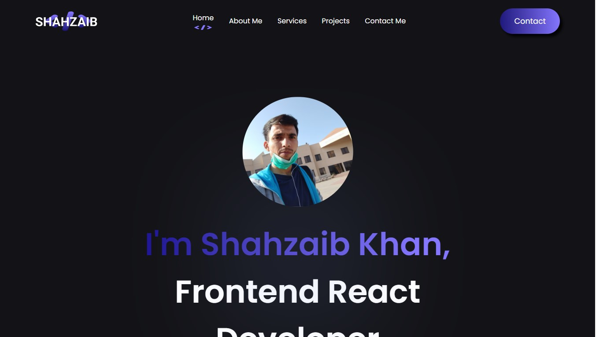
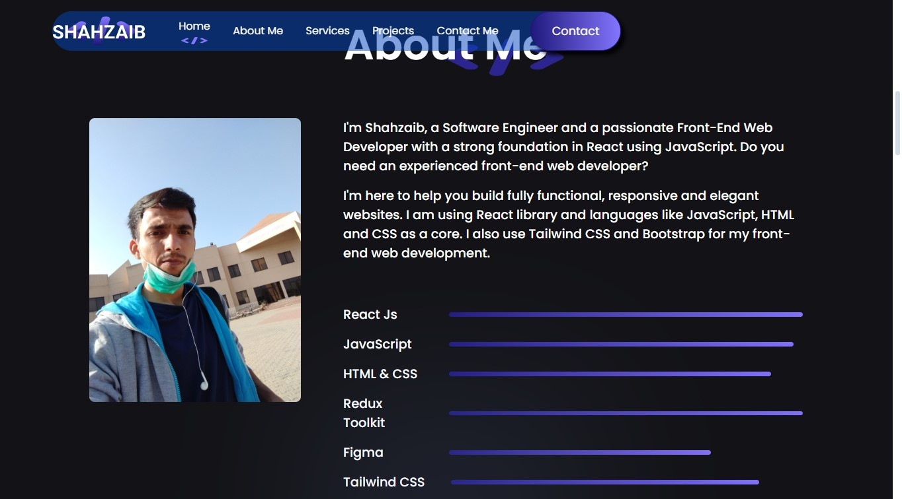
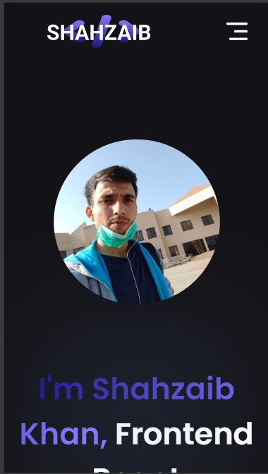
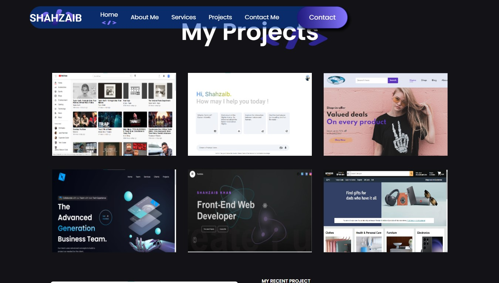
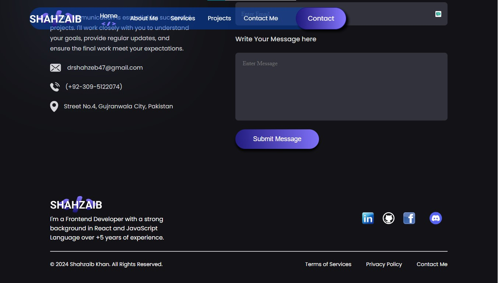

# My Personal Portfolio Website Developed with React + Vite

I Built a fully functional, responsive and beautiful Personal Portfolio Website using JavaScript, HTML and CSS, Git and 
Github, Redux Toolkit and ECMAScript on ReactJs. I have used many React libries as a main database and server for authentications and data storage using advanced JavaScript async 
await methods and ECMA Script methods. This website is available on my Github ID. I have also hosted 
this website on Vercel at this address [https://shahzaib-khan-portfolio.vercel.app](https://shahzaib-khan-portfolio.vercel.app) to make it 
available to the public

Currently, available on:

- [https://shahzaib-you-tube-clone.vercel.app](https://shahzaib-khan-portfolio.vercel.app)

